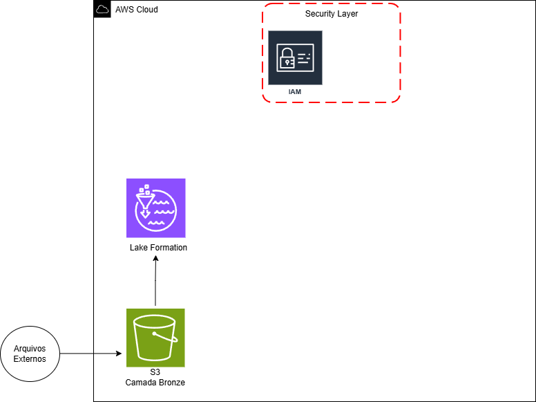

# Data Lake de Requisições de Serviço 311 de Boston (AWS)

Este projeto implementa uma pipeline de ingestão e armazenamento de dados para as requisições de serviço (311 Service Requests) da cidade de Boston, EUA. A arquitetura utiliza serviços nativos da Amazon Web Services (AWS) para construir um *Data Lake* governado, preparado para análise via AWS Athena.

## Visão Geral do Projeto

O projeto foca em extrair dados dos últimos três anos (2023, 2024 e 2025), transformá-los para um formato otimizado e carregá-los em um *Data Lake* governado, garantindo segurança e catalogação.

### Estrutura do Projeto

## Tecnologias e Ferramentas

| Categoria | Ferramenta / Tecnologia | Uso no Projeto |
| :--- | :--- | :--- |
| **Extração** | Python (`requests`) | Script para *web scraping* e download dos arquivos CSV. |
| **Processamento** | Python (`pandas`) | Leitura e conversão dos arquivos CSV para *DataFrames* e, posteriormente, para o formato Parquet. |
| **Orquestração** | Python (`boto3`, `dotenv`) | Gestão de credenciais e *upload* dos arquivos para o S3. |
| **Armazenamento** | AWS S3 (Camada Bronze) | Armazenamento persistente e centralizado dos dados brutos/bronzificados no formato Parquet. |
| **Data Lake** | AWS Lake Formation | Governança de dados, gerenciamento de segurança e catálogo de metadados. |
| **Segurança** | AWS IAM | Gerenciamento de acessos e permissões para usuários e serviços AWS. |

## Arquitetura (Diagrama Simplificado)

O fluxo de dados segue a seguinte estrutura:

1.  **Arquivos Externos**: Extração dos dados CSV do portal de dados de Boston.
2.  **S3 (Camada Bronze)**: Os dados são carregados no S3 no formato **Parquet**, otimizado para *Data Lakes*. Esta é a primeira camada do *Data Lake* (Camada Bronze).
3.  **Lake Formation**: Configurado para gerenciar e catalogar os dados no S3, garantindo governança, metadados e controle de acesso granular.
4.  **Security Layer (IAM)**: Controla o acesso ao S3 e ao Lake Formation, definindo quem pode ler, escrever ou gerenciar os recursos.

## Detalhamento dos Scripts

O projeto é dividido em etapas claras de ETL (Extract, Transform, Load) executadas em Python.

### 1\. Extração de Dados

O script utiliza a biblioteca `requests` para baixar os arquivos CSV dos três últimos anos diretamente da fonte de dados de Boston, armazenando-os localmente na pasta `data/`.

  * **URL Base**: `https://data.boston.gov/dataset/311-service-requests`
  * **Anos Extraídos**: 2023, 2024, 2025

### 2\. Processamento e Conversão

Os arquivos CSV extraídos são lidos e combinados/armazenados em *DataFrames* do `pandas`. A principal transformação nesta etapa é a conversão dos *DataFrames* para o formato **Parquet**, que é colunar e ideal para o S3/Data Lake.

### 3\. Carregamento para o AWS S3 (Bronze)

Utilizando `boto3` e credenciais configuradas via `dotenv`, os arquivos Parquet são enviados para o S3.

  * **Bucket de Destino**: `awsboston-datalake` (exemplo)
  * **Key (Caminho)**: `bronze/dados_{ano}.parquet`

### 4\. Configuração do Data Lake (AWS Lake Formation)

No ambiente AWS, o Lake Formation foi configurado para:

  * **Registro de Localização**: O *bucket* S3 (`s3://awsboston-datalake/bronze/`) foi registrado como a localização principal do *Data Lake*.
  * **Criação de Banco de Dados**: Um banco de dados foi criado no Lake Formation, apontando para o S3, permitindo que as tabelas sejam automaticamente inferidas.
  * **Governança**: Gerenciamento de segurança e metadados para as tabelas criadas a partir dos arquivos Parquet.

